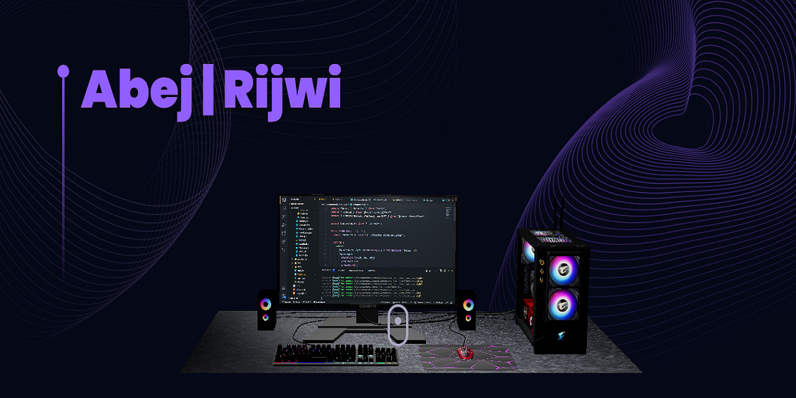

   
    
   
  

    
    
  

 

I'm a skilled software developer with a strong foundation in PHP, TypeScript, and JavaScript, and hands-on expertise in popular frameworks like CodeIgniter, React, Node.js, and Next.js. I specialize in building efficient, scalable, and user-friendly web applications that solve real-world problems. With a passion for clean code and a collaborative approach, I work closely with clients and teams to understand their goals and deliver high-quality solutions on time. I'm a quick learner who thrives in dynamic environments and continuously explores new technologies to stay ahead in the industry.

---

### 🛠️ Skills | Technologies

    
    
    
    
    
    
    
    
    
    
    
    
    
    
    
    
    

---

### 🚀 Featured Projects

- Building a full-stack clone of Threads (a social media platform) with Next.js 14+ involves several stages, including user interface design, backend API development, real-time features, user authentication, notifications, and community management. The platform should support various features like nested comments, real-time search, and notifications. [GitHub Repository](https://github.com/Abej-Rijwi/threads))

- Building a healthcare platform that streamlines patient registration, appointment scheduling, medical record management, complex forms, and SMS notifications is a large-scale project that involves both front-end and back-end components, integration with third-party services, and security measures to protect sensitive health data. [GitHub Repository](https://github.com/Abej-Rijwi/healthcare)
  
- The most impressive websites in the world use 3D graphics and animations to bring their content to life. Learn how to build your own ThreeJS 3D Developer Portfolio today! [GitHub Repository](https://github.com/Abej-Rijwi/portfolio)

---

### 📬 Get in Touch

  
  
  
  
  

---

